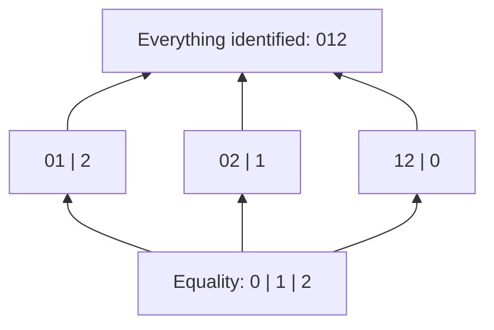
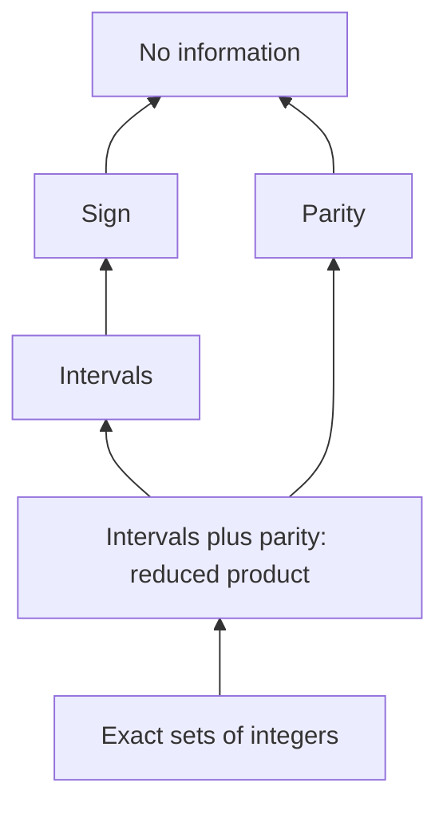
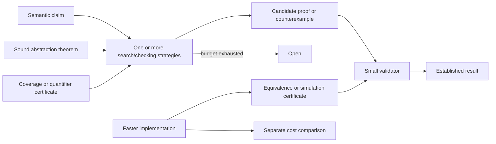

# Stream types, abstraction, and the orders they induce

Research and design analysis, 2026-09-18. No implementation proposal here has been landed.

The starting point is `STREAM_TYPES_PLAN.md`, especially its relation-based spaces, fair witness streams, proposed telescopes, and “optimization adjoints.” The status statement still matches the inspected files: endings are implemented in `lib/stream.disp` and `lib/verdict.disp`; the proposed `lib/space.disp` and `lib/tele.disp` are absent. Keep the plan for now, but revise the mathematical claims identified below before implementing those parts.

## 1. The closest existing answers

**Yes: the central idea has substantial precedents, but several different ideas need separating.**

1. **Types as computable approximations to general semantic properties.** Patrick Cousot's *Types as Abstract Interpretations* (1997) is the most direct match. It starts with semantics of an untyped language and derives type semantics through Galois connections, including a comparison of monomorphic and polymorphic systems. Its Figure 1 is already a lattice diagram of type abstractions. It does not establish that every possible type theory is one efficiently computable abstraction. [Paper, PDF pp. 1 and 15](https://www.di.ens.fr/~cousot/COUSOTpapers/publications.www/Cousot-POPL97-p316-331-1997.pdf#page=15).
2. **Types as selected parts of one universal semantic object.** Scott's *Data Types as Lattices* (1976) represents types using retractions of a universal domain: idempotent maps whose images are the selected types. This is particularly close to the normalizer intuition. A retraction alone is not an adjunction. [Scott, PDF p. 19](https://raw.githubusercontent.com/CMU-HoTT/scott/main/pdfs/1976-data-types-as-lattices.pdf#page=19).
3. **Types as sameness relations over untyped realizers.** Partial equivalence relations (PERs) and realizability give almost exactly the doc's semantic shape: membership is self-relatedness, and functions must preserve relatedness. The relation is mathematical; it need not be decidable or even semidecidable. [Chhabra, *Modest Sets are Equivalent to PERs*](https://arxiv.org/html/2411.08421v1).
4. **Types as a way to eliminate checks.** Soft typing is a direct operational precedent: infer what can be established statically and retain runtime checks for the rest. Hybrid checking extends this arrangement to expressive specifications. These are especially literal examples of types enabling optimizations. [Cartwright–Fagan retrospective, PDF p. 1](https://www.cs.rice.edu/CS/PLT/Publications/Java/sigplan39-4.pdf#page=1); [Knowles–Flanagan, PDF p. 1](https://kennknowles.com/research/knowles-flanagan.toplas.2010.pdf#page=1).
5. **Type constructors as actual adjoints.** Lawvere characterizes existential and universal quantification as left and right adjoints to substitution. With suitable dependent structure, this becomes the dependent sum/pullback/dependent product triple. This is the precise categorical connection for telescopes. [Lawvere, PDF p. 12](https://www.tac.mta.ca/tac/reprints/articles/16/tr16.pdf#page=12).
6. **Fast checking through separately checked evidence.** Proof-carrying code separates expensive proof construction from a small validator. This is the closest established architecture for the doc's “receipt whose checks never re-run the honest stream.” [Necula's account](https://people.eecs.berkeley.edu/~necula/pcc.html#overview).

My synthesis: **general semantics + partial evidence procedures + certified abstractions + certified transformations** is a strong unifying design. “Every faster checker is an adjoint” is too strong.

## 2. What counts as an adjunction here?

All formulas in this note are mathematical notation, not proposed disp definitions.

### 2.1 Abstraction: lose information soundly

Choose a concrete complete lattice C, such as sets of possible executions, and an abstract ordered domain A. An abstraction and concretization form a Galois connection when

\[
\alpha(c)\le_A a\quad\Longleftrightarrow\quad c\le_C\gamma(a).
\]

This says that α(c) is the **most precise representable overapproximation** of c. Consequently c ≤ γα(c), and αγ(a) ≤ a. It does not say that the concrete value is recovered exactly. The associated upper closure operator is ρ = γα. A Galois insertion additionally makes αγ the identity on A.

For a concrete monotone transformer F, the best transformer expressible in this abstraction is F♯ = αFγ. An implemented sound transformer may be less precise. Neither construction says it is cheap or computable. This framework and its lattice of abstraction levels originate with [Cousot–Cousot (1977)](https://www.di.ens.fr/~cousot/COUSOTpapers/POPL77.shtml).

For example, remembering only an integer's sign can prove that adding two positive inputs remains positive without remembering either integer. A checker can avoid concrete execution because the abstract operations preserve enough information for the requested property.

### 2.2 Retraction: choose representatives

A normalizer n with n(n(x)) = n(x) is an idempotent. With N its image, n: U → N and inclusion i: N → U satisfy ni = id. That makes N a retract. To obtain an order adjunction, extra conditions matter:

- If n is monotone and x ≤ n(x), it is a closure operator, and n is left adjoint to inclusion of its fixed points.
- If n is monotone and n(x) ≤ x, it is an interior operator, and inclusion is left adjoint to n.
- An arbitrary canonicalizer has neither inequality in any specified order. Idempotence and correctness of normalization are not enough.

This distinguishes the general retraction construction in [Scott](https://raw.githubusercontent.com/CMU-HoTT/scott/main/pdfs/1976-data-types-as-lattices.pdf#page=19) from the closure operators used for [abstract domains](https://www.math.unipd.it/~ranzato/papers/esop96.pdf#page=3).

### 2.3 Logical quantification: change context

For a function f: X → Y, inverse image on predicates has two adjoints:

\[
\exists_f\dashv f^*\dashv\forall_f.
\]

The left map takes the image of a predicate; the right map requires it of every element of a fiber. In suitable categories of dependent families, the corresponding triple is Σ_f ⊣ f* ⊣ Π_f. A telescope composes changes of context. This is stronger than the observation that one stream combinator can serve both existential and universal search: it specifies universal properties and substitution laws. [Lawvere](https://www.tac.mta.ca/tac/reprints/articles/16/tr16.pdf#page=12).

### 2.4 Optimization: preserve meaning and improve a separate cost

An optimized program p′ needs an appropriate semantic contract, for example observational equivalence with p, and a separate performance objective. A simulation can establish semantic preservation; cost measurements or a cost theorem establish improvement. Neither follows merely from an abstraction adjunction.

The appropriate equivalence may ignore internal steps, representation, and scheduling. Compiler correctness therefore often uses simulation diagrams rather than literal lockstep equality. Equality saturation separately maintains known equivalent expressions and extracts one according to a cost function. [CompCert, PDF p. 9](https://xavierleroy.org/publi/compcert-SSS2017.pdf#page=9); [egg, PDF p. 2](https://cnandi.com/docs/popl21-cr.pdf#page=2).

## 3. There are several lattices, not one

The following are different choices of objects and order. They should not be silently identified.

| Objects being ordered | Order convention | Mathematical structure | What it measures |
|---|---|---|---|
| Semantic predicates on a fixed U | Subset inclusion; smaller means stronger | Powerset Boolean lattice, classically | Which objects are admitted |
| PERs on a fixed U | Inclusion of related pairs | Complete, generally nondistributive lattice | Both membership and identifications |
| Equivalence relations on a fixed carrier S | Inclusion of related pairs | Complete partition lattice | Which distinctions are forgotten |
| Abstract domains over a fixed C | Pointwise order on upper closures; smaller means more precise | Complete lattice UCO(C) | Which concrete properties are expressible |
| Predicate families in context Γ | Entailment in each context | Indexed posets; often Heyting algebras in models | Dependent propositions and quantification |
| Proof-bearing types and maps | Actual terms/maps, not just their existence | Categories, possibly higher categories | Constructions, proof identity, transport |
| Checker answers | Unknown below either definite answer | Three-point information poset; not a lattice | Evidence acquired |
| Implementations of one specification | Chosen pointwise or aggregate cost comparison | Usually a preorder/Pareto order; no general lattice guarantee | Speed, space, code size, checking cost |

### 3.1 The exact lattice suggested by the doc's spaces

**Derivation for this proposal, from the PER definition.** Fix the universe U of trees. A PER R ⊆ U × U is symmetric and transitive. Its carrier is

\[
\operatorname{supp}(R)=\{x\mid R(x,x)\}.
\]

It is an equivalence relation on this carrier, without requiring every tree to belong. This fits a type more precisely than calling an arbitrary relation on all trees a setoid. PERs and their maps have the established realizability interpretation discussed in [Chhabra](https://arxiv.org/html/2411.08421v1).

Ordered by relation inclusion:

- Bottom is the empty relation; top is U × U.
- The meet of any family is its intersection. Symmetry and transitivity are preserved by intersection.
- The join is the smallest PER containing the union: its symmetric-transitive closure. Such a PER exists because the universal relation is an upper bound and intersections preserve PERs.
- Directed joins are simply unions. A finite transitivity check uses only two pairs, which already coexist in some member of a directed family.

The join is **not generally plain union**. On a common carrier with three elements, identifying 0 with 1 in one relation and 1 with 2 in another forces all three to be identified in their join.

This fixed-carrier sublattice is already nondistributive:

Here upward means **coarser equality**, with exactly the same members throughout. The three middle elements witness failure of distributivity: A ∧ (B ∨ C) = A, while (A ∧ B) ∨ (A ∧ C) = D.

There is also an actual adjoint triple directly connecting recognizers and relations. For S ⊆ U, define ΔS to be equality restricted to S, and ∇S = S × S. Then

\[
\boxed{\Delta\dashv\operatorname{supp}\dashv\nabla}
\]

because

\[
\Delta S\subseteq R\iff S\subseteq\operatorname{supp}(R),
\qquad
\operatorname{supp}(R)\subseteq S\iff R\subseteq S\times S.
\]

For the second equivalence, symmetry and transitivity ensure that any related pair has both endpoints in the support. These equivalences are the full order-adjunction laws, not analogies. They also give

\[
\Delta\operatorname{supp}(R)\subseteq R\subseteq\nabla\operatorname{supp}(R).
\]

Thus, among spaces with the same members, discrete equality identifies least and indiscrete equality identifies most. **The PER lattice's top is not the ordinary dynamic type:** it collapses every pair of trees. The type containing all trees with syntactic equality is ΔU, a different object.

Another real adjunction is PER-closure ⊣ inclusion, between arbitrary relations and PERs. This precisely describes generating a sameness relation from a smaller set of pairs. In contrast, merely executing a smaller pair stream does not itself supply an adjunction or a coverage proof.

Sanity check: exhaustive Python enumeration of the 15 PERs on a three-element universe verified both displayed equivalences for all 120 set/PER combinations and closure of all binary meets and joins. The arguments above establish the general result; the finite check only checks the formulas.

### 3.2 Why PER inclusion is not one simple “more permissive” order

Increasing the carrier admits more inputs. Increasing equality on the same carrier imposes **more obligations** on a function out of that carrier: it must treat more input pairs alike. In the codomain, coarser equality makes agreement easier.

For nondependent PER arrows, schematically,

\[
(f,g)\in(A\Rightarrow B)
\iff
\forall(x,y)\in A,\;(fx,gy)\in B,
\]

with the selected treatment of divergence made explicit. This constructor is contravariant in A and covariant in B under relation inclusion. For example, identity on three distinguishable values respects their discrete equality, but fails to respect the quotient identifying 0 and 1 when the result type still distinguishes them.

So one should track both **carrier refinement** and **equality coarsening** when discussing a space. Relation inclusion also need not mean that the identity-induced map between the quotient sets is injective: it may identify previously distinct classes.

### 3.3 The lattice of analysis designs

For a fixed complete concrete lattice C, Galois-insertion abstract domains, up to equivalent representation, correspond to upper closure operators ρ: C → C. Order them by

\[
\rho_1\preceq\rho_2\iff\forall c,\;\rho_1(c)\le\rho_2(c).
\]

Lower means more precise. Identity is the most precise domain; the constant-top map forgets everything. Their complete-lattice structure can be described by fixed-point sets: a meet combines available distinctions (the reduced product, taking its concrete meaning), whereas a join retains only common expressible distinctions. For closures, the meet is pointwise meet; the join is generally not pointwise join. [Giacobazzi–Ranzato, PDF p. 3](https://www.math.unipd.it/~ranzato/papers/esop96.pdf#page=3).

An illustrative fragment, with upward meaning loss of precision:

Intervals and parity are incomparable: an interval can bound a number but lose evenness; parity can preserve evenness but lose magnitude. This illustrates why a single ladder from simple types to dependent types cannot classify all analyses.

Important qualifications:

- The lattice theorem concerns semantic domains with the stated closure structure. Arbitrarily chosen syntactic type languages may lack best approximations, intersections, or joins until completed.
- Existence of a least upper bound says nothing about whether a finite syntax represents it or an algorithm computes it.
- More precise domains do not automatically give faster, or even practically more precise, analyzers once resource limits and widening strategies differ.
- Comparing systems over different concrete semantics requires explicit translations first.

### 3.4 A concept lattice induced by the typing judgment itself

There is an especially general construction if “type” means any chosen collection of semantic claims. Let P be programs and Φ be claims, with incidence p ⊨ φ. Define

\[
\operatorname{Th}(X)=\{\phi\mid\forall p\in X,\;p\models\phi\},
\quad
\operatorname{Mod}(\Psi)=\{p\mid\forall\phi\in\Psi,\;p\models\phi\}.
\]

Then Ψ ⊆ Th(X) iff X ⊆ Mod(Ψ). This is an antitone Galois connection, or an ordinary monotone adjunction after reversing one order. The pairs fixed by the two operations form a **formal concept lattice**: each concept is a class of programs together with all the selected claims common to that class. [Ganter–Wille, Basic Theorem, PDF p. 28](https://math.ubbcluj.ro/~csacarea/wordpress/wp-content/uploads/Prof.-Dr.-Bernhard-Ganter-Prof.-Dr.-Rudolf-Wille-auth.-Formal-Concept-Analysis_-Mathematical-Foundations-1999-Springer-Verlag-Berlin-Heidelberg.pdf#page=28).

This construction is exact relative to the chosen incidence relation. If incidence means “a checker proved it,” the lattice describes that checker's established knowledge. It is not automatically the lattice of semantic truth. Substituting a finite test corpus gives a useful empirical ontology, but implications found there remain corpus-relative.

### 3.5 Verdicts and costs

For a fixed claim, the evidence order is Open ≤ Proved and Open ≤ Refuted. The two definite answers are incomparable, with no common upper bound in that three-element set. Adding an explicit inconsistent-evidence element completes it to a four-element diamond. It should represent a broken assumption or conflicting evidence, not another successful result.

This order differs from a truth order. The repo's `agree` permits Open to agree with either definite verdict, so it measures compatibility, not equality or proof of soundness. In particular, an always-Open checker is compatible with every checker. Three-valued runtime verification offers a close established counterpart, though its observations are execution prefixes rather than streams of candidate counterexamples. [Bauer–Leucker–Schallhart, PDF p. 1](https://cs.uwaterloo.ca/~bbonakda/teaching/CS745/papers/RV.pdf#page=1).

For costs, pointwise dominance over workloads is a partial comparison after quotienting equal costs. Two implementations can trade time for space or win on different inputs. A least-cost implementation need not exist under the selected order, and a semantic adjunction promises no cost bound. A useful optimizer therefore needs an explicit workload and objective, in addition to correctness.

Two checkers can implement exactly the same semantic abstraction with very different costs. They occupy the same node in the abstraction lattice. Conversely, a stronger proof strategy can settle a claim that raw enumeration never settles at all: that is increased proving capability, not merely a constant-factor speedup of the same operational behavior. Under a finite budget, cost and proving capability interact, but they remain different contracts.

## 4. Research ontology

This graph is an ontology of constructions and proof methods, **not a subtyping diagram or a claim that every edge is an adjunction**. “Abstract” edges require a specified concrete semantics and soundness theorem. The table supplies the evidence and limits.

```mermaid
flowchart TB
  U["General execution semantics: values, states, traces, environments"]
  U -->|"sets of possible behavior"| AI["Abstract interpretation"]
  U -->|"realizers and sameness"| PER["PERs and realizability"]
  U -->|"observe executions"| SEARCH["Search and runtime evidence"]
  U -->|"assertions about transitions"| LOGIC["Program logics"]
  U -->|"compare implementations"| OPT["Certified transformations"]
  U -->|"retain proofs and maps"| CAT["Categorical type structure"]

  AI --> HM["Simple types and ML inference"]
  AI --> SIZE["Sized types and termination"]
  AI --> SET["Semantic subtyping and set-theoretic types"]
  AI --> NUM["Intervals, signs, relational numeric analyses"]
  AI --> LIQ["Refinement and Liquid types"]
  AI --> FX["Effects and event traces"]
  AI --> MC["Model checking and CEGAR"]
  AI --> AAM["Abstract machines and control-flow analysis"]
  AI --> AGT["Gradual precision over static types"]
  AI --> PROB["Probabilistic analyses"]

  PER --> QUOT["Quotients and canonical representatives"]
  PER --> REL["Logical relations and parametricity"]
  PER --> SCOTT["Related universal-domain approach: retracts"]
  SEARCH --> SEMI["Semidecision and fair enumeration"]
  SEARCH --> RV["Three-valued runtime verification"]
  SEARCH --> COMP["Compact and searchable spaces"]

  LOGIC --> WP["Hoare logic and predicate transformers"]
  LOGIC --> SEP["Separation logic"]
  LOGIC --> INC["Incorrectness logic"]
  LOGIC --> HYPER["Hyperproperties and information flow"]
  SEP --> OWN["Ownership and borrowing: RustBelt"]
  WP --> DIJK["Dijkstra monads"]
  REL --> OWN

  CAT --> DEP["Dependent sums, products, telescopes"]
  CAT --> LIN["Linear and affine resources"]
  CAT --> MOD["Modal and adjoint type theories"]
  CAT --> HOTT["Identity types, HoTT, truncation"]
  LIN --> QTT["Quantitative and graded types"]
  LIN --> SES["Session protocols"]
  QTT --> METRIC["Sensitivity and privacy metrics"]
  QTT --> AMORT["Amortized resource analysis"]
  QTT --> MULTI["Non-idempotent intersection types"]

  OPT --> SOFT["Soft and hybrid checking: remove checks"]
  OPT --> SIM["Simulations and compiler correctness"]
  OPT --> EGG["Equality saturation and cost extraction"]
  OPT --> PCC["Proof-carrying code and validation"]
  AI -->|"facts justify changes"| OPT
  DEP -->|"express certificates"| PCC
```

### 4.1 Types and analyses

The placement column is my comparison to the proposal; it is not a theorem identifying whole systems.

| Family | What it keeps or proves | Connection to the proposal; important limit | Primary source |
|---|---|---|---|
| Simple types | Basic value/function compatibility | Coarse abstract semantic properties; does not require exact member enumeration | [Cousot 1997](https://www.di.ens.fr/~cousot/COUSOTpapers/publications.www/Cousot-POPL97-p316-331-1997.pdf#page=15) |
| ML/Hindley–Milner polymorphism | Reusable type schemes and principal inference | A structured abstraction/inference discipline; type variables are not arbitrary executable predicates | [Cousot 1997](https://www.di.ens.fr/~cousot/COUSOTpapers/publications.www/Cousot-POPL97-p316-331-1997.pdf#page=15) |
| Intersection types | Multiple simultaneous behaviors of one term | Can characterize normalization and support filter models; expressive variants lose decidable inference | [van Bakel survey](https://www.doc.ic.ac.uk/~svb/Research/Papers/Survey.pdf#page=3) |
| Semantic subtyping, unions, intersections, negation | Inclusion between denotations of types | Connects to the predicate lattice; arrow types make the semantic-model construction nontrivial | [Castagna–Frisch](https://www.irif.fr/~gc/papers/icalp-ppdp05.pdf#page=1) |
| Refinement/Liquid types | Value predicates, often solver-friendly | Restricted predicates make inference tractable; Liquid types combine ML inference with predicate abstraction | [Rondon–Kawaguchi–Jhala](https://goto.ucsd.edu/~rjhala/papers/liquid_types.html) |
| Numeric abstract domains | Signs, ranges, congruences, relationships | A large supply of useful type-like properties outside conventional type syntax | [Cousot–Cousot](https://www.di.ens.fr/~cousot/COUSOTpapers/POPL77.shtml) |
| Gradual types | Partial knowledge of a static type | AGT abstracts sets of static types; its precision order is distinct from semantic subtyping and budgeted proof search | [Garcia–Clark–Tanter](https://www.cs.ubc.ca/~rxg/agt.pdf#page=1) |
| Soft typing | Which dynamic checks can be omitted | Particularly literal “typing as optimization”; unproved safety can retain dynamic checks | [Cartwright–Fagan](https://www.cs.rice.edu/CS/PLT/Publications/Java/sigplan39-4.pdf#page=1) |
| Contracts and hybrid checking | Expressive interface predicates, statically or dynamically checked | Sound static success removes a check; failure to prove need not be a semantic refutation | [Knowles–Flanagan](https://kennknowles.com/research/knowles-flanagan.toplas.2010.pdf#page=1) |
| Type-and-effect systems | Events such as exceptions, reads, writes, protocols | Need event traces or another effect semantics, not just returned trees; composition may be noncommutative | [Gordon, June 2026 draft](https://arxiv.org/abs/2606.19686#download-button-info) |
| Sized and termination types | Bounds on inductive/coinductive structure | Can establish termination or productivity uniformly where testing cannot | [Hughes's account of sized types](https://www.cse.chalmers.se/~rjmh/pubs.htm#typespec) |
| Universal-domain/retract types | Selected subdomains and representations | Closest to normalizers; a retraction need not be an order adjoint | [Scott](https://raw.githubusercontent.com/CMU-HoTT/scott/main/pdfs/1976-data-types-as-lattices.pdf#page=19) |
| PER and quotient types | Membership and extensional equality together | Direct match to the proposed spaces, provided the relation laws hold | [Chhabra](https://arxiv.org/html/2411.08421v1) |
| Parametric polymorphism/logical relations | Uniform behavior under related interpretations | Can justify equations and representation independence; a same-type PER alone does not express all cross-type relations | [Wadler, *Theorems for free*](https://homepages.inf.ed.ac.uk/wadler/topics/parametricity.html#free) |
| Dependent type theory | Families indexed by values, proof-bearing specifications | Telescopes fit indexed families; coherent substitution and transport matter | [Lawvere](https://www.tac.mta.ca/tac/reprints/articles/16/tr16.pdf#page=12) |
| Linear and affine types | Restrictions on duplication/discarding and resource use | Facts about contexts and use, not simply subsets of result values; can justify destructive update | [Wadler](https://homepages.inf.ed.ac.uk/wadler/topics/linear-logic.html#linear-types) |
| Quantitative/graded types | Usage quantities and resource composition | Fits the planned grades, but variable usage, evaluator cost, and proof cost are distinct quantities | [Atkey](https://bentnib.org/quantitative-type-theory.pdf#page=1) |
| Automatic amortized resource analysis | Potential attached to data pays for computation | Particularly relevant to proving evaluator-cost bounds; resource accounting can be inferred within restricted fragments | [Hoffmann–Aehlig–Hofmann](https://www.cs.cmu.edu/~janh/assets/pdf/HoffmannAH12.pdf#page=1) |
| Non-idempotent intersection types | Multiplicity-sensitive derivations and evaluation bounds | Unlike ordinary set intersection, using a type twice retains quantitative information; tight derivations can capture exact evaluation lengths under specified strategies | [Accattoli–Graham-Lengrand–Kesner](https://www.irif.fr/~kesner/papers/icfp-2018.pdf#page=1) |
| Ownership and borrowing | Valid access to changing resources | Requires state, lifetimes/worlds, and resource assertions; a bare value relation forgets essential information | [RustBelt](https://people.mpi-sws.org/~dreyer/papers/rustbelt/paper.pdf#page=4) |
| Session types | Legal communication protocols | Relate types to interactions; the cited system derives fidelity and deadlock freedom from linear proof structure | [Caires–Pfenning](https://www.cs.cmu.edu/~fp/papers/concur10.pdf#page=1) |
| Modal/adjoint type theories | Movement between modes or contexts | Literal adjoints exist with specified categorical structure; modalities need not mean optimization | [Gratzer et al.](https://www.danielgratzer.com/papers/modalities-and-parametric-adjoints.pdf#page=1) |
| Homotopy type theory and truncation | Identity proofs and higher identifications | Truncation gives genuine reflection into lower homotopy levels; cannot be recovered from a Boolean equality test alone | [HoTT book, §7.3](https://arxiv.org/pdf/1308.0729#page=236) |
| Call-by-push-value | Separate values, computations, and stacks | Adjunction-based organization of effects and evaluation; useful if one universal value domain hides execution distinctions | [Levy](https://www.tac.mta.ca/tac/volumes/14/5/14-05abs.html) |

### 4.2 Verification, search, and transformation

| Family | Semantic object/evidence | Connection and limit | Primary source |
|---|---|---|---|
| Hoare logic and predicate transformers | State relations, pre/postconditions, invariants | Relational strongest postconditions are left adjoint to universal relational preimages; termination must be modeled separately or explicitly included | [Cousot, program-logics derivation](https://arxiv.org/abs/2310.15340#download-button-info) |
| Dijkstra monads | Computations indexed by specifications | Composes effectful verification through a specification monad; a substantial generalization of a result recognizer | [Maillard et al.](https://arxiv.org/abs/1903.01237#download-button-info) |
| Separation logic | Assertions about separable pieces of state | Separating conjunction and implication form a resource-sensitive adjunction; ordinary intersection is insufficient | [Reynolds](https://www.cs.cmu.edu/~jcr/seplogic.pdf#page=1) |
| Incorrectness logics | Underapproximations of reachable behavior | Explains certified bugs and reachable witnesses; reverses the inclusion direction used by overapproximating safety analyses | [Cousot](https://arxiv.org/abs/2310.15340#download-button-info) |
| Abstract model checking and CEGAR | Abstract transition systems, counterexample traces | Refine the abstraction after ruling out a spurious counterexample; abstract failure alone is not concrete refutation | [Clarke et al.](https://www.cs.cmu.edu/~emc/papers/Papers%20In%20Refereed%20Journals/Counterexample-guided%20abstraction%20refinement.pdf#page=2) |
| Higher-order control-flow analysis | Abstract machine states and stores | Direct precedent for deriving a checker from an evaluator; finite approximation loses information | [Van Horn–Might](https://arxiv.org/abs/1007.4446#download-button-info) |
| Runtime verification | Finite observations of potentially infinite runs | Three-valued answers resemble the verdict layer; absence of a bad prefix is not a general proof | [Bauer–Leucker–Schallhart](https://cs.uwaterloo.ca/~bbonakda/teaching/CS745/papers/RV.pdf#page=1) |
| Coinduction and bisimulation | Relations preserved by transition structure | Uniform certificates for infinite behavior; finite trace agreement alone is weaker | [Rutten](https://ir.cwi.nl/pub/48/0048D.pdf#page=9) |
| Information flow and hyperproperties | Relations between runs or sets of runs | Two-sided checks are a useful beginning; general properties of systems require sets of traces, not just one trace | [Clarkson–Schneider](https://www.cs.cornell.edu/fbs/publications/Hyperproperties.pdf#page=1) |
| Probabilistic verification | Probability-sensitive execution semantics | Possible outcomes alone lose probabilities; sampling confidence is not exhaustive proof | [Cousot–Monerau](https://pcousot.github.io/publications/Cousot-Monerau-ESOP2012-extended.pdf#page=1) |
| Sensitivity and differential-privacy types | Distances and bounds on how functions change them | A genuine quantitative enrichment of relations; distance on values is not automatically runtime cost | [Reed–Pierce, Fuzz](https://www.cis.upenn.edu/~bcpierce/papers/dp.pdf#page=1) |
| Synthetic topology and searchable spaces | Semidecision, observation, compactness | Explains which infinite checks can finish under totality/continuity assumptions | [Escardó](https://martinescardo.github.io/papers/exhaustive.pdf#page=1) |
| Proof-carrying code | Program plus checkable derivation | Strong architectural fit for optimization certificates; validation still rests on a sound checker and policy | [Necula](https://people.eecs.berkeley.edu/~necula/pcc.html#overview) |
| Verified compilation | Simulations preserving observations | A correct fast implementation need not follow the same internal steps | [CompCert](https://xavierleroy.org/publi/compcert-SSS2017.pdf#page=9) |
| Equality saturation | Congruence classes of expressions and a cost model | Separates equality discovery from implementation selection; cheapest represented expression is not a globally optimal program | [egg](https://cnandi.com/docs/popl21-cr.pdf#page=2) |
| Formal concept analysis | Programs versus attributes/claims | Provides an ontology lattice from a satisfaction relation; unknown empirical entries cannot be silently treated as false | [Ganter–Wille](https://math.ubbcluj.ro/~csacarea/wordpress/wp-content/uploads/Prof.-Dr.-Bernhard-Ganter-Prof.-Dr.-Rudolf-Wille-auth.-Formal-Concept-Analysis_-Mathematical-Foundations-1999-Springer-Verlag-Berlin-Heidelberg.pdf#page=28) |

The recent effects result deserves a qualification. Gordon's June 2026 paper explicitly treats a general class of effect systems through event-occurrence abstraction; it is labeled a draft short paper. It should not be expanded into a theorem about every dependent or polymorphic effect system. The broader ontology above is a synthesis of separate results, not an established universal equivalence theorem.

## 5. How far can a stream implementation go?

### 5.1 A partial Boolean program is not an arbitrary semantic predicate

If a relation program may diverge, interpreting “related” as “eventually returns true” gives a computably enumerable positive relation. Fair scheduling lets every terminating positive computation eventually contribute evidence. It does not turn missing evidence into negative evidence.

There is a structural asymmetry:

- Existential search over an effectively enumerable family of positive semidecisions can dovetail them and return when one succeeds.
- A universal claim with decidable instances can search for a counterexample, but generally cannot confirm itself by finishing an infinite list.
- A universal claim whose instances are only positively semidecidable need not even have enumerable failures: a failed instance can diverge forever.

This matches the connection between semidecidable properties and observable opens developed in [Escardó's synthetic topology, PDF p. 15](https://martinescardo.github.io/papers/entcs87.pdf#page=15). The mathematical collection of opens has more closure structure than the effectively presented operations necessarily compute.

### 5.2 Higher-order membership crosses the boundary immediately

For total functions on naturals, membership requires

\[
\forall x\;\exists t\;\text{“the program returns a valid result on x within t steps.”}
\]

The bounded-step predicate is decidable, but the whole condition is a general Π⁰₂ condition. Thus higher-order PERs cannot in general all be implemented by positive semidecision procedures of the proposed form.

A short independent argument: suppose all total computable natural-valued functions had an effective enumeration. Evaluating the nth enumerated function at n and adding one would define a total computable function absent from the enumeration. Therefore no such enumeration can be complete. Enumerating **proof-certified** total functions avoids the contradiction by potentially omitting true total functions.

The semantic PER category can support arrows; the subclass with computably enumerable underlying relations need not be closed under that construction. Making every program a resumable task fixes starvation, not this closure problem.

### 5.3 Quantifier shape is not a verdict by itself

The plan's blanket “∀∃ claims stay Open by construction” needs narrowing:

- For a finite, certified outer domain, each existential search can eventually find a witness, allowing the whole claim to succeed.
- A decidable bounded inner domain can establish failure by exhaustion.
- A supplied witness function with a checked uniform proof can establish an infinite claim.
- Over arbitrary unbounded naturals, general ∀∃ claims have no complete terminating decision procedure. A budgeted search should stay Open whenever the required evidence has not arrived.

Even the simpler “no counterexample exists” property requires specifying what counts as a counterexample. If totality is required, divergence is a semantic violation with no generic finite execution witness. Therefore a contract that only forbids a confirmer from contradicting the stream's finite witnesses is too weak to establish total correctness.

### 5.4 Infinite does not always mean unsearchable

Escardó gives algorithms for exhaustive checking over certain infinite spaces, including Cantor space, under the relevant higher-type totality and continuity assumptions. The algorithm reasons through finite observations sufficient for the predicate, rather than finishing an enumeration of every element. An infinite subset of discrete naturals does not get the same general property. The paper also explicitly distinguishes Kleene–Kreisel totality from the weaker hereditarily effective reading; this distinction matters for a code-as-data language. [Escardó, PDF pp. 1–2](https://martinescardo.github.io/papers/exhaustive.pdf#page=1).

For disp this suggests an eventual **certified quantifier/search operator**, with the space and predicate assumptions in its contract. It is not a reason to let an unfinished raw tree enumeration report Proved. A tree-inspecting predicate is not automatically a continuous extensional predicate on the represented stream space.

### 5.5 A common encoding does not erase semantic differences

Trees can encode programs, heaps, traces, formulas, and certificates. That gives one representation language, not one sufficient notion of observation. Ownership needs resources and worlds; temporal properties need runs; probability needs probability-sensitive semantics; hyperproperties compare systems; dependent and higher types retain evidence and transport.

The same warning applies to “all types live inside a universal type.” A universal type of program representations does not enumerate all mathematical functions or supply a consistent impredicative universe automatically. It also does not make semantic truth decidable.

## 6. Specific changes to make in the stream plan's explanation

These are design findings, not edits to the plan or code.

| Current claim or construction | More precise version |
|---|---|
| An arbitrary relation function is a space/setoid | Treat it as a candidate relation until symmetry and transitivity are established for its positive meaning. Membership is then its support. Distinguish mathematical relations from their partial implementations. |
| Normalizers, generators, and diagonals are all adjoints | Call them certified strategies. Use “adjoint” where both maps, their orders/categories, and the universal property are specified. The Δ ⊣ support ⊣ ∇ and relation-closure adjunctions above are actual examples. |
| The normalizer-defined relation is a quotient of any base relation | If it is to coarsen the base's equality, require base-related inputs to have equal normal forms. Otherwise it is a new equivalence relation on the same support, not necessarily a quotient of that base. |
| Pairs (a, n(a)) suffice | Require n(a) to remain in the domain, require n to classify the intended equivalence classes and choose representatives (e.g. an idempotent normalizer), and establish the codomain PER laws. Those generator obligations then imply respect for arbitrary related pairs. Partial n or an unproved completeness property cannot silently discharge the obligation. |
| Arbitrary environment-indexed spaces give dependent telescopes | Families must respect equality of environments; genuinely dependent outputs may require transport or heterogeneous relations between the two fibers. The raw environment-to-relation function does not enforce this. |
| A finite source is itself a certificate that it covers the type | A supplied list is an assertion. Coverage needs checked evidence or an explicit trusted premise. Reaching done proves exhaustion of that list, not its coverage of a semantic domain. |
| All arrow spaces can use the same semidecidable member interface | General arrow membership need not be semidecidable. Separate semantic formation from the available search/checking strategies, or state a restricted fragment. |
| Every ∀∃ claim necessarily stays Open | State the unbounded computability limitation and the particular procedure's guarantees. Finite domains, witnesses, and certified quantifiers give important exceptions. |
| Agreement with a witness stream establishes soundness | Compatibility with Open is weak, and absence of finite bad witnesses may omit divergence obligations. Soundness must target a stated semantic claim. |
| Sound abstraction means concretization undoes abstraction; its unit is a bisimulation trace | Abstraction generally loses information. Use an inclusion/simulation theorem for soundness. A unit has a specified categorical type; an execution trace is not automatically such a unit. |
| Exhausting finitely many dispatch shapes proves the rule lemma | A finite number of rule schemas can still quantify over infinitely many payloads, substitutions, and stacks. Give a symbolic/uniform proof of each schema, not merely a finite test of representatives. |
| Optimized and reference machines should be in lockstep | Lockstep may work for a deliberately matched machine refactoring. General optimizations need stuttering/weak simulation or another appropriate observation-preservation relation, including divergence conditions. |
| A Boolean plus recursively specified path spaces gives a homotopy space | At most this sketches underlying higher relational data. Identities, composition, transport, coherence, and suitable equivalences still need definitions and proofs. An arbitrary bisimulation relation is not itself a checked path certificate. |
| Path length or dispatch count is the distance the optimizer descends | Specify what paths are, how they compose, and what costs measure. Runtime improvement can be directed; proof length need not correlate with program runtime. A metric or semiring requires additional laws. |

In particular, the planned path layer should distinguish a finite derivation of an equation from an infinite behavioral certificate. Checking a finite prefix of an infinite bisimulation does not prove the whole bisimulation. A finite invariant plus a uniform preservation proof can do so. [Rutten's definition](https://ir.cwi.nl/pub/48/0048D.pdf#page=9) and [HoTT's reflection into n-types](https://arxiv.org/pdf/1308.0729#page=236) describe different structures; combining them requires an explicit model.

## 7. A workable conceptual organization for disp

My recommendation is to preserve the proposal's common representation and fair scheduling, but split its mathematical responsibilities:

1. **Meaning.** A claim denotes a property of a chosen semantic object: values, related runs, resources, distributions, or proof-bearing objects. PERs are an especially good foundation for the current extensional value layer.
2. **Evidence.** Finite witnesses, coverage proofs, induction proofs, invariants, and simulations have explicit validators. A timeout produces no logical conclusion.
3. **Strategies.** Enumeration, a solver, a symbolic evaluator, abstract interpretation, and specialized decision procedures are ways to obtain evidence. Strategies can be composed or fairly interleaved without identifying them with the claims themselves.
4. **Optimization.** A change preserves the specified meaning and carries separately stated cost evidence. The checker, its search strategy, and the subject program can each be optimized, with different contracts.

The most useful next mathematical exercise is not to implement the whole ontology. It is to specify one nontrivial space, its relation laws, one honest enumeration strategy, one faster strategy, and the exact theorem connecting their evidence to the same semantic claim. A finite Boolean domain and a quotient of natural-number representations would expose different obligations. Any dependent example should additionally show how equality of environments transports the codomain.

## 8. Reading route and verification record

For the central question: read Cousot 1997, Scott's retractions section, and the PER construction. For the lattice: read Giacobazzi–Ranzato §2 and compare the PER derivation above. For telescopes: read Lawvere's hyperdoctrines section. For implementation boundaries: read Escardó, runtime verification, and proof-carrying code. The ontology table gives the further branches without pretending they are all reductions to the same theorem.

All externally linked sources in this note were fetched and passage-matched with `scripts/verify-source.sh -q` during this session. PDF fragments refer to physical PDF pages, which can differ from printed page numbers. Some publisher/repository pages blocked fetching or returned only a JavaScript shell; the citations use accessible primary texts or author accounts instead. The TAC host required the verifier's reported TLS fallback. The source papers establish the cited constructions; the proposed organization for disp, the PER lattice derivation, and the critique of the plan are this note's analysis.

No disp/vitest runs were needed. The only computation was the small finite lattice sanity check described above.
